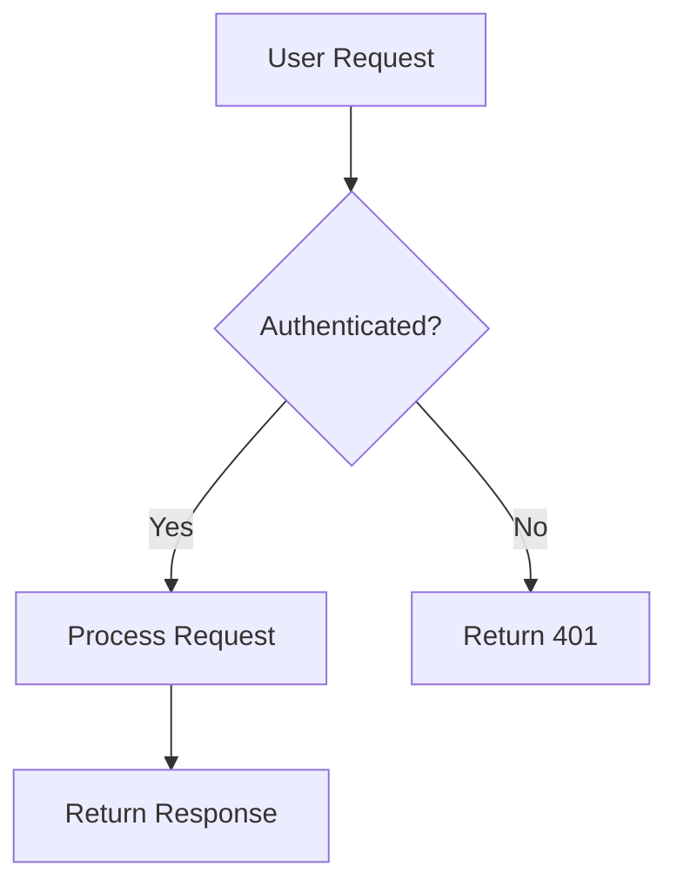

---
applyTo:
  - "**/*.md"
  - "**/README*"
---

# Documentation Instructions

> **Applies to:** All Markdown files, README files

## 🎯 Purpose

Clear, concise, and helpful documentation that serves both users and developers.

## Critical Documentation Rules

**ALWAYS:**
- ✅ Write for your audience (users vs developers)
- ✅ Use clear, simple language
- ✅ Include practical examples
- ✅ Keep documentation in sync with code
- ✅ Use proper Markdown formatting
- ✅ Include table of contents for long docs
- ✅ Date-stamp important changes

**NEVER:**
- ❌ Include outdated information
- ❌ Use jargon without explanation
- ❌ Duplicate information across files
- ❌ Forget to update docs when changing code
- ❌ Include sensitive information (keys, passwords)

## Documentation Structure

### README.md Template

```markdown
# Project Name

> One-line description of what this project does

## Overview

Brief introduction (2-3 sentences) explaining the purpose and key features.

## Quick Start

```bash
# Installation
npm install

# Development
npm run dev

# Production
npm run build
```

## Features

- Feature 1: Brief description
- Feature 2: Brief description
- Feature 3: Brief description

## Prerequisites

- Node.js 18+
- PostgreSQL 14+
- Redis (optional)

## Installation

Step-by-step installation instructions.

## Configuration

Environment variables and configuration options.

## Usage

Common use cases and examples.

## API Documentation

Link to API docs or brief overview.

## Contributing

Link to CONTRIBUTING.md or brief guidelines.

## License

License information.
```

### API Documentation Format

```markdown
## Endpoint Name

**Description:** Brief description of what this endpoint does.

**Method:** `POST`

**URL:** `/api/endpoint`

**Authentication:** Required (Bearer token)

**Request Body:**

```json
{
  "field1": "string (required)",
  "field2": "number (optional)"
}
```

**Response (200 OK):**

```json
{
  "success": true,
  "data": {
    "id": "string",
    "created_at": "ISO 8601 timestamp"
  }
}
```

**Error Responses:**

- `400 Bad Request` - Invalid input
- `401 Unauthorized` - Missing or invalid token
- `404 Not Found` - Resource not found

**Example:**

```bash
curl -X POST https://api.example.com/api/endpoint \
  -H "Authorization: Bearer YOUR_TOKEN" \
  -H "Content-Type: application/json" \
  -d '{"field1": "value"}'
```
```

## Markdown Best Practices

### Headings

```markdown
# H1 - Document Title (only one per file)

## H2 - Major Sections

### H3 - Subsections

#### H4 - Minor Details

Use hierarchical structure - don't skip levels.
```

### Code Blocks

```markdown
Use fenced code blocks with language specification:

```go
func main() {
    fmt.Println("Hello")
}
```

For shell commands:

```bash
npm install
go build
```

For inline code: `variable` or `function()`
```

### Lists

```markdown
**Unordered lists:**
- Item 1
- Item 2
  - Nested item
  - Another nested

**Ordered lists:**
1. First step
2. Second step
3. Third step

**Task lists:**
- [x] Completed task
- [ ] Pending task
```

### Tables

```markdown
| Column 1 | Column 2 | Column 3 |
|----------|----------|----------|
| Value 1  | Value 2  | Value 3  |
| Value 4  | Value 5  | Value 6  |

Align columns:
| Left | Center | Right |
|:-----|:------:|------:|
| Text | Text   | Text  |
```

### Links and References

```markdown
**External links:**
[Link text](https://example.com)

**Internal links:**
[Section](#section-name)

**Reference-style links:**
[Link text][reference]

[reference]: https://example.com
```

### Emphasis

```markdown
**Bold text** for strong emphasis
*Italic text* for mild emphasis
~~Strikethrough~~ for deprecated content
`code` for inline code
```

### Blockquotes

```markdown
> Important note or quote
> 
> Second paragraph of quote

> 💡 **Tip:** Use emoji for callouts
> ⚠️ **Warning:** Important warning
> 🚨 **Critical:** Critical information
```

## Documentation Types

### API Documentation

Focus on:
- Endpoint URLs and HTTP methods
- Request/response formats
- Authentication requirements
- Error codes and handling
- Rate limiting
- Versioning

### User Guides

Focus on:
- Step-by-step instructions
- Screenshots or diagrams
- Common workflows
- Troubleshooting
- FAQ

### Technical Documentation

Focus on:
- Architecture overview
- Design decisions
- Integration points
- Performance considerations
- Security model
- Database schema

### Contributing Guide

Include:
- How to set up development environment
- Code style guidelines
- Testing requirements
- Pull request process
- Code review checklist

## Ministry Mapper Specific

### Collection Documentation

```markdown
## Collection: `territories`

**Description:** Geographical zones within congregations

**Type:** Base collection

**Fields:**

| Field | Type | Required | Description |
|-------|------|----------|-------------|
| code | Text | Yes | Unique territory identifier |
| description | Text | No | Territory name or description |
| progress | Number | No | Completion percentage (0-100) |
| congregation | Relation | Yes | Parent congregation |

**Relations:**

- `congregation` → Many-to-one with `congregations`
- Maps → One-to-many with `maps`

**API Rules:**

- List: `@request.auth.id != ""`
- View: `@request.auth.id != ""`
- Create: `@request.auth.role = "admin"`
- Update: `@request.auth.role = "admin"`
- Delete: `@request.auth.role = "admin"`

**Indexes:**

- `idx_territory_congregation` on `congregation`
- `idx_territory_code` on `code`
```

### Feature Documentation

```markdown
## Feature: Territory Quicklink

**Status:** ✅ Production

**Purpose:** Automatically assign optimal map to user based on location and workload.

**Algorithm:**

1. **Filter** maps in requested territory
2. **Calculate** assignment count per map
3. **Compute** distance from user location (Haversine)
4. **Rank** by: workload (primary), proximity (secondary), progress (tertiary)
5. **Return** best match within 50m threshold

**API Endpoint:** `POST /territory/link`

**Request:**
```json
{
  "territory": "territory_id",
  "coordinates": {"lat": 1.23, "lng": 103.45}
}
```

**Response:**
```json
{
  "map_id": "map123",
  "distance": 35.7,
  "assignment_count": 1
}
```

**Business Rules:**

- Prioritize maps with fewer assignments
- Only consider maps within 50 meters
- Skip maps with 100% completion
- Create assignment on successful match

**Files:**
- Handler: `internal/handlers/get_quicklink.go`
- Tests: None (needs testing)

**Future Improvements:**
- [ ] Add time-based weighting (recent assignments)
- [ ] Consider publisher skill level
- [ ] Machine learning for optimal assignment
```

## Changelog Format

```markdown
# Changelog

All notable changes to this project will be documented in this file.

The format is based on [Keep a Changelog](https://keepachangelog.com/en/1.0.0/).

## [Unreleased]

### Added
- New feature description

### Changed
- Change description

### Deprecated
- Deprecated feature

### Removed
- Removed feature

### Fixed
- Bug fix description

### Security
- Security fix description

## [1.2.0] - 2024-01-15

### Added
- Territory quicklink feature (#123)
- Monthly Excel report generation (#124)

### Fixed
- Aggregate calculation for multi-floor maps (#125)

## [1.1.0] - 2023-12-01

...
```

## Comment Documentation (GoDoc)

```go
// Package handlers provides HTTP request handlers for custom API endpoints.
//
// All handlers follow PocketBase conventions and require authentication
// via apis.RequireAuth() middleware. Errors are logged to Sentry before
// returning user-friendly API errors.
package handlers

// HandleMapAdd creates a new address code within a map.
//
// The handler validates input, generates the next sequence number,
// and creates an address record with the specified code and floor.
//
// Request body:
//   - map: string (required) - Map ID
//   - code: string (required) - Address code
//   - floor: string (optional) - Floor identifier for multi-level maps
//
// Returns 200 OK with the created address record or 400 Bad Request on error.
func HandleMapAdd(c *core.RequestEvent, app *pocketbase.PocketBase) error {
    // Implementation...
}
```

## Documentation Maintenance

### When to Update Documentation

Update docs when:
- Adding new features or endpoints
- Changing API contracts
- Modifying configuration options
- Fixing bugs that affect usage
- Changing environment variables
- Updating dependencies with breaking changes

### Documentation Review Checklist

Before committing documentation changes:
- [ ] Spelling and grammar checked
- [ ] Code examples tested and working
- [ ] Links verified (no 404s)
- [ ] Screenshots up-to-date
- [ ] Version numbers correct
- [ ] No sensitive information included
- [ ] Consistent formatting throughout
- [ ] Table of contents updated
- [ ] Changelog entry added

## Visual Elements

### Diagrams (Mermaid)

```markdown

```

### Badges

```markdown


```

### Emoji Usage

Use sparingly and consistently:
- 🎯 Purpose/Goal
- ✅ Success/Completed
- ❌ Error/Prohibited
- ⚠️ Warning
- 💡 Tip/Idea
- 🚨 Critical
- 📝 Note
- 🔧 Configuration
- 🐛 Bug
- 🚀 Performance

## Documentation Tools

- **Linting:** markdownlint for consistency
- **Previewing:** VS Code Markdown Preview
- **Diagrams:** Mermaid, PlantUML
- **API Docs:** Swagger/OpenAPI, Postman
- **Screenshots:** Use PNG with compression

## Writing Style

### Voice and Tone

- **Active voice:** "Run the command" not "The command should be run"
- **Present tense:** "The function returns" not "The function will return"
- **Direct:** Get to the point quickly
- **Helpful:** Anticipate questions

### Word Choice

- **Simple over complex:** "use" not "utilize"
- **Specific over vague:** "Click Submit" not "Click the button"
- **Consistent terminology:** Pick one term and stick with it

### Sentence Structure

- Keep sentences short (15-20 words ideal)
- One idea per sentence
- Use parallel structure in lists
- Avoid nested clauses

## Documentation Anti-Patterns

**Avoid:**
- "Simply" or "just" (what's simple for you may not be for others)
- "Obviously" or "clearly" (if it were obvious, they wouldn't be reading)
- Gender-specific pronouns (use "they" or "the user")
- Absolute terms like "always" or "never" (unless truly absolute)
- Marketing speak in technical docs
- Assuming prior knowledge without links

## Examples of Good Documentation

**Good:**
```markdown
## Starting the Server

Run the following command to start the development server:

```bash
go run main.go serve --http=0.0.0.0:8090
```

The server will start on port 8090. Access the admin UI at http://localhost:8090/_/
```

**Bad:**
```markdown
## Server

Simply run the server and it will obviously start on the default port. Just navigate to the admin area.
```

## Summary

Well-maintained documentation is as important as the code itself. It serves as the primary interface between your project and its users, contributors, and future maintainers. Invest time in clear, accurate, and helpful documentation.
