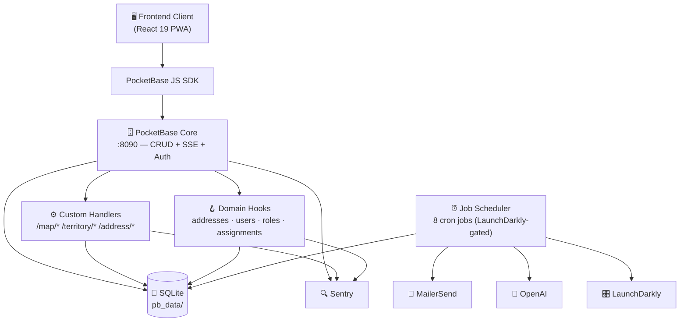
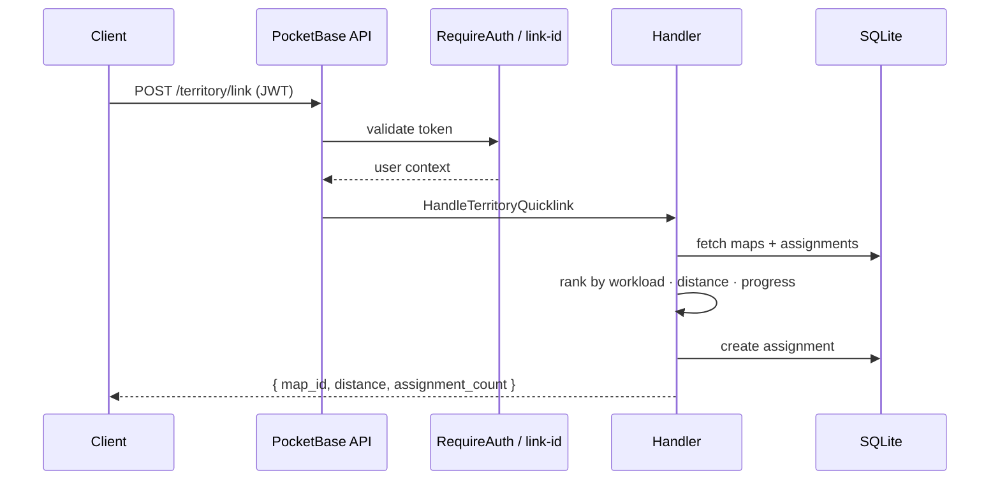

# 🗺️ Ministry Mapper Backend

> Self-hosted territory management system for religious congregations — built on PocketBase and Go.

<p align="center">
  <a href="https://go.dev/"></a>
  <a href="https://pocketbase.io/"></a>
  <a href="https://www.sqlite.org/"></a>
  <a href="https://www.docker.com/"></a>
  <a href="LICENSE"></a>
</p>

---

## 📋 Table of Contents

- [✨ Features](#-features)
- [🏗️ Architecture](#️-architecture)
- [🚀 Quick Start](#-quick-start)
- [🐳 Docker Deployment](#-docker-deployment)
- [⚙️ Configuration](#️-configuration)
- [⏰ Scheduled Jobs](#-scheduled-jobs)
- [🛠️ Development](#️-development)
- [🧪 Testing](#-testing)
- [📡 API Reference](#-api-reference)
- [🔒 Security](#-security)
- [📚 Documentation](#-documentation)

---

## ✨ Features

<table>
  <tr>
    <td>🔐 <b>Auth & Access Control</b></td>
    <td>JWT auth with role-based permissions (administrator / conductor / read_only)</td>
  </tr>
  <tr>
    <td>🌍 <b>Territory Management</b></td>
    <td>Hierarchical congregations → territories → maps → addresses</td>
  </tr>
  <tr>
    <td>📍 <b>Smart Quicklink</b></td>
    <td>Proximity-based map assignment using Haversine distance + workload balancing</td>
  </tr>
  <tr>
    <td>📈 <b>Aggregation Engine</b></td>
    <td>Debounced, semaphore-guarded real-time progress tracking per map and territory</td>
  </tr>
  <tr>
    <td>📊 <b>Real-time Updates</b></td>
    <td>Server-Sent Events (SSE) via PocketBase subscriptions for live field sync</td>
  </tr>
  <tr>
    <td>📧 <b>Email Digests</b></td>
    <td>Message, instruction, notes, and new-address digests via MailerSend</td>
  </tr>
  <tr>
    <td>📑 <b>Monthly Excel Reports</b></td>
    <td>Auto-generated congregation reports with territory grids, DNC lists, and stats</td>
  </tr>
  <tr>
    <td>🤖 <b>AI Summaries</b></td>
    <td>Optional OpenAI-powered narrative summaries inside reports and digests</td>
  </tr>
  <tr>
    <td>👤 <b>User Lifecycle</b></td>
    <td>Automated inactivity warnings and deprovisioning (NIST SP 800-53 AC-2 aligned)</td>
  </tr>
  <tr>
    <td>🔍 <b>Observability</b></td>
    <td>Sentry error tracking with log forwarding and panic recovery on all jobs</td>
  </tr>
  <tr>
    <td>🎛️ <b>Feature Flags</b></td>
    <td>All background jobs gated by LaunchDarkly flags — toggle without redeployment</td>
  </tr>
  <tr>
    <td>🩺 <b>Health Check</b></td>
    <td>SQLite <code>PRAGMA quick_check</code> endpoint for uptime monitoring</td>
  </tr>
</table>

<p align="right"><a href="#ministry-mapper-backend">↑ back to top</a></p>

---

## 🏗️ Architecture



### Request Flow



<p align="right"><a href="#ministry-mapper-backend">↑ back to top</a></p>

---

## 🚀 Quick Start

### Prerequisites

| Tool | Version | Notes |
|------|---------|-------|
| [Go](https://go.dev/dl/) | 1.24+ | `brew install go` |
| Git | any | — |

### Installation

```bash
# 1. Clone
git clone git@github.com:rimorin/ministry-mapper-be.git
cd ministry-mapper-be

# 2. Install dependencies
./scripts/install.sh

# 3. Configure environment
cp .env.sample .env
# Minimum required: PB_ADMIN_EMAIL, PB_ADMIN_PASSWORD, MAILERSEND_API_KEY

# 4. Start development server
./scripts/start.sh
```

> [!NOTE]
> Server: **http://localhost:8090** · Admin UI: **http://localhost:8090/\_/**

> [!TIP]
> Without `LAUNCHDARKLY_SDK_KEY` all feature flags default to **enabled**, so background jobs run immediately in development.

<p align="right"><a href="#ministry-mapper-backend">↑ back to top</a></p>

---

## 🐳 Docker Deployment

```bash
# Build image
docker build -t ministry-mapper .

# Run container
docker run -d \
  --name ministry-mapper \
  -p 8080:8080 \
  -v /path/to/pb_data:/app/pb_data \
  --env-file .env \
  ministry-mapper
```

> [!IMPORTANT]
> Always mount `/app/pb_data` to a **persistent volume**. This directory holds the SQLite database, user uploads, and PocketBase configuration. Losing it means losing all data.

<p align="right"><a href="#ministry-mapper-backend">↑ back to top</a></p>

---

## ⚙️ Configuration

### Core Environment Variables

| Variable | Description | Default | Required |
|----------|-------------|---------|:--------:|
| `PB_APP_URL` | Frontend application URL | `http://localhost:3000` | ✅ |
| `PB_ALLOW_ORIGINS` | CORS origins (comma-separated) | `*` | ✅ |
| `PB_APP_NAME` | Application display name | `Ministry Mapper` | — |
| `PB_ADMIN_EMAIL` | Bootstrap superuser email | — | ✅ |
| `PB_ADMIN_PASSWORD` | Bootstrap superuser password | — | ✅ |
| `MAILERSEND_API_KEY` | MailerSend API key for all outbound email | — | ✅ |
| `MAILERSEND_FROM_EMAIL` | Sender email address | — | ✅ |
| `LAUNCHDARKLY_SDK_KEY` | LaunchDarkly SDK key for feature flags | — | ✅ |
| `LAUNCHDARKLY_CONTEXT_KEY` | LaunchDarkly environment context identifier | — | ✅ |
| `SENTRY_DSN` | Sentry DSN for error tracking | — | ✅ |
| `SENTRY_ENV` | Environment label (`development` / `staging` / `production`) | `development` | ✅ |
| `OPENAI_API_KEY` | OpenAI key for AI-generated summaries in reports/digests | — | ⚠️ AI only |

<details>
<summary>📋 Additional environment variables (SMTP, auth, rate limiting)</summary>

| Variable | Description | Default |
|----------|-------------|---------|
| `PB_SMTP_HOST` | SMTP relay host | `""` |
| `PB_SMTP_PORT` | SMTP port | `587` |
| `PB_SMTP_USERNAME` | SMTP username | `""` |
| `PB_SMTP_PASSWORD` | SMTP password | `""` |
| `PB_SMTP_SENDER_ADDRESS` | Envelope sender address | `support@ministry-mapper.com` |
| `PB_SMTP_SENDER_NAME` | Envelope sender name | `MM Support` |
| `PB_OTP_ENABLED` | Enable one-time-password auth | `false` |
| `PB_MFA_ENABLED` | Enable multi-factor auth | `false` |
| `PB_ENABLE_RATE_LIMITING` | Enable API rate limiting | `false` |
| `PB_HIDE_CONTROLS` | Hide PocketBase admin controls | `false` |

</details>

### Default Ports

| Environment | Port | Notes |
|-------------|------|-------|
| Development | `8090` | set by `./scripts/start.sh` |
| Docker | `8080` | configurable via `-p` flag |

<p align="right"><a href="#ministry-mapper-backend">↑ back to top</a></p>

---

## ⏰ Scheduled Jobs

All jobs are **LaunchDarkly-gated** — toggle any job on or off without redeployment. When LaunchDarkly is not configured, all flags default to enabled.

Schedules are staggered so no two jobs fire at the same minute. Heavy, non-urgent jobs run at **02:00–03:00 SGT (18:00–19:00 UTC)** — well clear of the peak field-service window (08:00–12:00 SGT).

> [!NOTE]
> Map progress (done %, not-home counts) is recalculated in real time via a debounced `OnRecordAfterUpdateSuccess` hook on `addresses` — not by a cron job. A 10-second debounce coalesces rapid taps into a single DB write, and a semaphore (max 5) prevents SQLite saturation during peak bursts.

| Job | Cron (UTC) | SGT | Feature Flag | Description |
|-----|-----------|-----|--------------|-------------|
| `cleanUpAssignments` | `1,6,11,…,56 * * * *` | every 5 min | `enable-assignments-cleanup` | Expire and remove stale map assignments |
| `processMessages` | `8,38 * * * *` | every 30 min | `enable-message-processing` | Send unread message digest emails |
| `processInstructions` | `18,48 * * * *` | every 30 min | `enable-instruction-processing` | Send territory instruction digest emails |
| `processNotes` | `28 * * * *` | every hour | `enable-note-processing` | Send updated address notes digest |
| `generateMonthlyReport` | `0 18 1 * *` | 02:00 SGT, 1st | `enable-monthly-report` | Build & email Excel report to all admins |
| `processUnprovisionedUsers` | `0 18 * * *` | 02:00 SGT daily | `enable-unprovisioned-user-processing` | Warn then disable users with no role |
| `processInactiveUsers` | `30 18 * * *` | 02:30 SGT daily | `enable-inactive-user-processing` | Warn then disable inactive accounts |
| `processNewAddresses` | `0 19 * * *` | 03:00 SGT daily | `enable-new-addresses-notification` | Digest of app-created addresses (last 24 h) |

<p align="right"><a href="#ministry-mapper-backend">↑ back to top</a></p>

---

## 🛠️ Development

### Scripts

| Script | Purpose |
|--------|---------|
| `./scripts/install.sh` | Install Go module dependencies |
| `./scripts/start.sh` | Start development server on `:8090` |
| `./scripts/update.sh` | Update all Go dependencies |
| `./scripts/test.sh` | Bootstrap test DB and run integration tests |

### Project Structure

```
ministry-mapper-be/
├── main.go                         # Entrypoint: wires Sentry, hooks, routes, scheduler
├── internal/
│   ├── handlers/                   # Custom HTTP endpoint handlers
│   │   ├── common.go               # Shared DB helpers & auth utilities
│   │   ├── get_quicklink.go        # POST /territory/link — proximity assignment
│   │   ├── update_aggregates.go    # Map & territory progress recalculation
│   │   ├── generate_report.go      # POST /report/generate — on-demand reports
│   │   └── ...                     # Map, territory, address, options handlers
│   ├── jobs/                       # Background job implementations
│   │   ├── job_scheduler.go        # Cron setup + LaunchDarkly flag wiring
│   │   ├── generate_report.go      # Monthly Excel report builder (MailerSend + OpenAI)
│   │   ├── llm_client.go           # OpenAI client wrapper
│   │   ├── summary_data.go         # Report analytics & LLM prompt builder
│   │   └── process_*.go            # Individual job implementations
│   ├── middleware/                 # Sentry error middleware & job panic recovery
│   └── setup/
│       ├── routes.go               # Route registration & CORS
│       └── hooks.go                # PocketBase record hooks (addresses, users, roles)
├── migrations/                     # DB migrations (seed file is testdata-only)
├── templates/                      # Go HTML email templates
├── scripts/                        # Dev & CI helper scripts
├── test_pb_data/                   # Generated test DB (gitignored)
└── pb_data/                        # PocketBase runtime data (gitignored)
```

<p align="right"><a href="#ministry-mapper-backend">↑ back to top</a></p>

---

## 🧪 Testing

Integration tests require a local test database generated by `scripts/test.sh`. The DB is **not committed** to git — it is created on demand to prevent secrets from leaking via migration env vars.

### Run Tests

```bash
./scripts/test.sh
```

This script:
1. Wipes any existing `test_pb_data/`
2. Bootstraps a fresh DB with seed data (`go run -tags testdata`)
3. Checkpoints WAL files and verifies row counts
4. Runs all integration tests (`go test ./...`)

### Seed Data Reference

All seeded IDs are stable and safe to hard-code in tests:

<details>
<summary>📋 Expand seed data table</summary>

| Resource | IDs |
|----------|-----|
| Congregations | `testcongalpha01`, `testcongbeta001` |
| Territories | `testterralpha01`, `testterralpha02`, `testterrbeta001` |
| Maps | `testmapalpha01a`, `testmapalpha01b`, `testmapalpha02a`, `testmapalpha02b`, `testmapbeta001a`, `testmapbeta001b` |
| Users (password: `Test1234!`) | `admin@alpha.test` (administrator), `conductor@alpha.test` (conductor), `readonly@alpha.test` (read_only), `admin@beta.test`, `xcong@beta.test` |

</details>

To add or change seeded records, edit `migrations/1780000000_seed_test_data.go`, then re-run `./scripts/test.sh`.

> [!NOTE]
> The script unsets all production env vars before bootstrapping so migration fallback defaults are always used — no real credentials can leak into the generated DB.

<p align="right"><a href="#ministry-mapper-backend">↑ back to top</a></p>

---

## 📡 API Reference

### PocketBase Standard API

Use the [PocketBase JavaScript SDK](https://github.com/pocketbase/js-sdk) for standard CRUD, real-time subscriptions, and authentication.

```javascript
import PocketBase from "pocketbase";

const pb = new PocketBase("http://localhost:8090");

// Authenticate
await pb.collection("users").authWithPassword("user@example.com", "password");

// Real-time subscription (SSE)
pb.collection("addresses").subscribe("*", (e) => {
  console.log(e.action, e.record);
});
```

### Custom Endpoints

> [!NOTE]
> Routes marked **JWT or link-id** accept either a `Authorization: Bearer <token>` header **or** a `link-id` header for publisher (unauthenticated) access. All other custom routes require a valid JWT.

#### Public / Self-authenticated

| Endpoint | Auth | Description |
|----------|------|-------------|
| `GET /api/db-health` | None | SQLite `PRAGMA quick_check` health probe |
| `POST /link/map` | `link-id` | Resolve a share link to its map and territory |
| `POST /map/addresses` | JWT or `link-id` | Get all addresses and options for a map |
| `POST /address/update` | JWT or `link-id` | Update an address status or notes |
| `POST /address/add` | JWT or `link-id` | Create a new address on a map |

#### Administrator Routes

| Endpoint | Role | Description |
|----------|------|-------------|
| `POST /map/codes` | Administrator | List distinct address codes for a map |
| `POST /map/code/add` | Administrator | Add one or more address codes |
| `POST /map/code/delete` | Administrator | Delete an address code |
| `POST /map/codes/update` | Administrator | Reorder address codes within a map |
| `POST /map/floor/add` | Administrator | Add a floor to a multi-level map |
| `POST /map/floor/remove` | Administrator | Remove a floor (refuses to remove last floor) |
| `POST /map/reset` | Administrator | Reset all addresses in a map to `not_done` |
| `POST /map/add` | Administrator | Create a new map with initial addresses |
| `POST /map/territory/update` | Administrator | Move a map to a different territory |
| `POST /maps/sequence` | Administrator | Reorder maps within a territory |
| `POST /options/update` | Administrator | Batch create / update / delete address options |
| `POST /report/generate` | Administrator | Trigger an on-demand congregation report |

#### Administrator or Conductor Routes

| Endpoint | Role | Description |
|----------|------|-------------|
| `POST /territory/reset` | Administrator or Conductor | Reset all maps in a territory |
| `POST /territory/delete` | Administrator or Conductor | Delete a territory and all its maps |

#### Any Authenticated User

| Endpoint | Role | Description |
|----------|------|-------------|
| `POST /territory/link` | Any | Smart map assignment (Quicklink) |

<details>
<summary>📬 Quicklink algorithm details</summary>

`POST /territory/link` ranks available maps by three criteria in priority order:

1. **Workload** — maps with fewer active assignments are preferred
2. **Proximity** — Haversine distance from the user's coordinates (50 m threshold)
3. **Progress** — maps with lower completion % are preferred; 100% complete maps are skipped

On a successful match an assignment record is created with an expiry derived from the congregation's `expiry_hours` setting.

**Request body:**
```json
{ "territory": "<territory_id>", "coordinates": { "lat": 1.23, "lng": 103.45 } }
```

**Response:**
```json
{ "map_id": "<map_id>", "distance": 35.7, "assignment_count": 1 }
```

</details>

<p align="right"><a href="#ministry-mapper-backend">↑ back to top</a></p>

---

## 🔒 Security

> [!WARNING]
> Never commit `.env` files, API keys, or admin credentials to version control.

- ✅ Always use **HTTPS** in production
- ✅ Store all secrets as environment variables (never in source code)
- ✅ Rotate credentials regularly and keep dependencies updated (`./scripts/update.sh`)
- ✅ The test seed script strips all production env vars before bootstrapping — safe to run in CI

---

## 📚 Documentation

| Resource | Description |
|----------|-------------|
| **[Official Docs](https://doc.ministry-mapper.com)** | Complete user and developer guides |
| **[Frontend Repo](https://github.com/rimorin/ministry-mapper-v2)** | Ministry Mapper v2 — React 19 + TypeScript PWA |
| [PocketBase Docs](https://pocketbase.io/docs/) | PocketBase platform documentation |
| [Go API Reference](https://pkg.go.dev/github.com/pocketbase/pocketbase) | Go package reference |

---

## 📄 License

[MIT License](LICENSE)

---

## 🙏 Acknowledgments

Built with [PocketBase](https://pocketbase.io/) — an open-source BaaS platform with a built-in admin dashboard, real-time subscriptions, SQLite, file storage, and user authentication.

<p align="right"><a href="#ministry-mapper-backend">↑ back to top</a></p>
