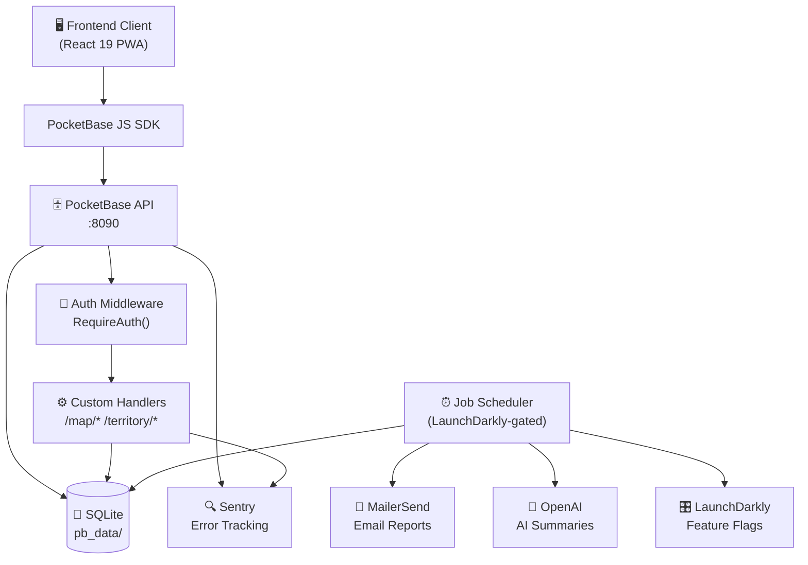

# 🗺️ Ministry Mapper Backend

> Self-hosted territory management system built on PocketBase.

<p align="center">
  <a href="https://go.dev/"></a>
  <a href="https://pocketbase.io/"></a>
  <a href="https://www.sqlite.org/"></a>
  <a href="LICENSE"></a>
</p>

---

## 📋 Table of Contents

- [✨ Features](#-features)
- [🏗️ Architecture](#️-architecture)
- [🚀 Quick Start](#-quick-start)
- [🐳 Docker Deployment](#-docker-deployment)
- [⚙️ Configuration](#️-configuration)
- [⏰ Scheduled Jobs](#-scheduled-jobs)
- [🛠️ Development](#️-development)
- [🧪 Testing](#-testing)
- [📡 API Integration](#-api-integration)
- [🔒 Security](#-security)
- [📚 Documentation](#-documentation)

---

## ✨ Features

<table>
  <tr>
    <td>🔐 <b>Authentication</b></td>
    <td>User auth & role-based access control</td>
    <td>🌍 <b>Territory Management</b></td>
    <td>Organize maps, addresses & coordinates</td>
  </tr>
  <tr>
    <td>📍 <b>Smart Assignment</b></td>
    <td>Proximity-based map-to-user matching</td>
    <td>📊 <b>Real-time Updates</b></td>
    <td>Server-Sent Events (SSE) for live sync</td>
  </tr>
  <tr>
    <td>📈 <b>Aggregation Engine</b></td>
    <td>Automated territory progress tracking</td>
    <td>⏰ <b>Scheduled Jobs</b></td>
    <td>Background tasks for reports & processing</td>
  </tr>
  <tr>
    <td>📧 <b>Email Reports</b></td>
    <td>Monthly Excel reports via MailerSend</td>
    <td>🤖 <b>AI Summaries</b></td>
    <td>LLM-generated content summaries</td>
  </tr>
  <tr>
    <td>👤 <b>User Lifecycle</b></td>
    <td>Inactivity warnings & auto-deprovisioning</td>
    <td>📋 <b>Analytics</b></td>
    <td>Address logs, audit views & data exports</td>
  </tr>
  <tr>
    <td>🔍 <b>Error Tracking</b></td>
    <td>Sentry integration for monitoring</td>
    <td>🎛️ <b>Feature Flags</b></td>
    <td>LaunchDarkly for controlled rollouts</td>
  </tr>
</table>

<p align="right"><a href="#ministry-mapper-backend">↑ back to top</a></p>

---

## 🏗️ Architecture



<p align="right"><a href="#ministry-mapper-backend">↑ back to top</a></p>

---

## 🚀 Quick Start

### Prerequisites

| Tool | Version |
|------|---------|
| [Go](https://go.dev/dl/) | 1.25+ |
| Git | any |

### Installation

```bash
# Clone repository
git clone git@github.com:rimorin/ministry-mapper-be.git
cd ministry-mapper-be

# Install dependencies
./scripts/install.sh

# Configure environment
cp .env.sample .env
# Edit .env with your settings

# Start development server
./scripts/start.sh
```

> [!NOTE]
> The server starts at **http://localhost:8090**
> Admin UI is available at **http://localhost:8090/\_/**

<p align="right"><a href="#ministry-mapper-backend">↑ back to top</a></p>

---

## 🐳 Docker Deployment

```bash
# Build image
docker build -t ministry-mapper .

# Run container
docker run -d \
  --name ministry-mapper \
  -p 8080:8080 \
  -v /path/to/pb_data:/app/pb_data \
  --env-file .env \
  ministry-mapper
```

> [!IMPORTANT]
> Always map `/app/pb_data` to a **persistent volume** to preserve:
> - SQLite database
> - User uploads
> - Configuration files

<p align="right"><a href="#ministry-mapper-backend">↑ back to top</a></p>

---

## ⚙️ Configuration

### Environment Variables

Key variables (see `.env.sample` for the complete list):

| Variable | Description | Required |
|----------|-------------|:--------:|
| `PB_APP_URL` | Frontend application URL | ✅ |
| `PB_ALLOW_ORIGINS` | CORS origins (comma-separated) | ✅ |
| `MAILERSEND_API_KEY` | Email service API key | ✅ |
| `LAUNCHDARKLY_SDK_KEY` | Feature flags SDK key | ✅ |
| `LAUNCHDARKLY_CONTEXT_KEY` | LaunchDarkly environment context key | ✅ |
| `SENTRY_DSN` | Error tracking DSN | ✅ |
| `SENTRY_ENV` | Environment (`development`/`staging`/`production`) | ✅ |
| `OPENAI_API_KEY` | OpenAI API key for AI-generated summaries | ⚠️ AI only |

### Default Ports

| Environment | Port |
|-------------|------|
| Development | `8090` |
| Docker | `8080` _(configurable)_ |

<p align="right"><a href="#ministry-mapper-backend">↑ back to top</a></p>

---

## ⏰ Scheduled Jobs

All jobs are gated by **LaunchDarkly feature flags** and can be toggled without redeployment.

Schedules are staggered so no two jobs fire at the same minute, avoiding CPU pile-ups at top-of-hour.
Heavy non-urgent jobs (reports, user lifecycle) run at **02:00–02:30 SGT (18:00–18:30 UTC)** — well clear of the peak field-service window (08:00–12:00 SGT).

| Job | Schedule (UTC) | SGT | Flag | Description |
|-----|---------------|-----|------|-------------|
| `cleanUpAssignments` | Every 5 min at :01 | :09 | `enable-assignments-cleanup` | Remove expired map assignments |
| `updateTerritoryAggregates` | Every 10 min at :04 | :12 | `enable-territory-aggregations` | Recalculate territory progress stats |
| `processMessages` | Every 30 min at :08, :38 | :16, :46 | `enable-message-processing` | Process pending message queue |
| `processInstructions` | Every 30 min at :18, :48 | :26, :56 | `enable-instruction-processing` | Process territory assignment instructions |
| `processNotes` | Every hour at :28 | :36 | `enable-note-processing` | Process updated congregation notes |
| `generateMonthlyReport` | 1st of month 18:00 UTC | 02:00 SGT | `enable-monthly-report` | Generate & email Excel report to admins |
| `processUnprovisionedUsers` | Daily 18:00 UTC | 02:00 SGT | `enable-unprovisioned-user-processing` | Warn/disable users with no role |
| `processInactiveUsers` | Daily 18:30 UTC | 02:30 SGT | `enable-inactive-user-processing` | Warn/disable inactive accounts |

<p align="right"><a href="#ministry-mapper-backend">↑ back to top</a></p>

---

## 🛠️ Development

### Update Dependencies

```bash
./scripts/update.sh
```

### Project Structure

```
ministry-mapper-be/
├── internal/
│   ├── handlers/      # API endpoint handlers
│   ├── jobs/          # Background job schedulers & LLM client
│   └── middleware/    # Request middleware
├── migrations/        # Database migrations (1780000000_seed_test_data.go is testdata-only)
├── templates/         # Email templates (reports, user lifecycle)
├── scripts/           # Development scripts
├── test_pb_data/      # Generated test DB (gitignored — run scripts/test.sh to create)
└── pb_data/           # PocketBase data (gitignored)
```

---

## 🧪 Testing

Integration tests require a local test DB generated by `scripts/test.sh`. The DB is **not committed** to git — it is generated on demand and kept out of source control to prevent secrets from leaking via migration env vars.

### Run Integration Tests

```bash
./scripts/test.sh
```

This script:
1. Wipes any existing `test_pb_data/`
2. Bootstraps a fresh DB with seed data (using `go run -tags testdata`)
3. Checkpoints WAL files
4. Verifies expected row counts
5. Runs all integration tests

### Seed Data Reference

All seeded IDs are stable and safe to hard-code in tests:

| Resource | IDs |
|----------|-----|
| Congregations | `testcongalpha01`, `testcongbeta001` |
| Territories | `testterralpha01`, `testterralpha02`, `testterrbeta001` |
| Maps | `testmapalpha01a`, `testmapalpha01b`, `testmapalpha02a`, `testmapalpha02b`, `testmapbeta001a`, `testmapbeta001b` |
| Users (password: `Test1234!`) | `admin@alpha.test` (administrator), `conductor@alpha.test` (conductor), `readonly@alpha.test` (read_only), `admin@beta.test`, `xcong@beta.test` |

### Update the Seed

To add or change seeded records, edit `migrations/1780000000_seed_test_data.go`, then re-run:

```bash
./scripts/test.sh
```

> [!NOTE]
> `test_pb_data/` is gitignored. The script unsets all production env vars before bootstrapping so that migration fallback defaults are always used — no real credentials can leak into the generated DB.

<p align="right"><a href="#ministry-mapper-backend">↑ back to top</a></p>

---

## 📡 API Integration

Use the [PocketBase JavaScript SDK](https://github.com/pocketbase/js-sdk) to interact with the backend.

### Authentication Example

```javascript
import PocketBase from "pocketbase";

const pb = new PocketBase("http://localhost:8090");
await pb.collection("users").authWithPassword("user@example.com", "password");
```

### Custom Endpoints

> [!NOTE]
> Most custom routes require a valid JWT (`Authorization: Bearer <token>`). The one exception is `POST /map/addresses`, which accepts either a JWT **or** a publisher `link-id` header — it is the only route accessible without a user account.

| Endpoint | Auth | Role | Description |
|----------|------|------|-------------|
| `POST /map/addresses` | JWT or `link-id` | Any role / publisher | Get addresses and options for a map |
| `POST /map/codes` | JWT | Administrator | Get distinct address codes for a map |
| `POST /map/code/add` | JWT | Administrator | Add one or more address codes |
| `POST /map/code/delete` | JWT | Administrator | Delete an address code |
| `POST /map/codes/update` | JWT | Administrator | Reorder address codes |
| `POST /map/floor/add` | JWT | Administrator | Add a floor to a multi-level map |
| `POST /map/floor/remove` | JWT | Administrator | Remove a floor from a map |
| `POST /map/reset` | JWT | Administrator | Reset all addresses in a map |
| `POST /map/add` | JWT | Administrator | Create a new map |
| `POST /map/territory/update` | JWT | Administrator | Move a map to another territory |
| `POST /territory/reset` | JWT | Administrator or Conductor | Reset all maps in a territory |
| `POST /territory/delete` | JWT | Administrator or Conductor | Delete a territory and its maps |
| `POST /territory/link` | JWT | Any role | Smart map assignment (Quicklink) |
| `POST /options/update` | JWT | Administrator | Update congregation address options |
| `POST /report/generate` | JWT | Administrator | Trigger on-demand report generation |

<p align="right"><a href="#ministry-mapper-backend">↑ back to top</a></p>

---

## 🔒 Security

> [!WARNING]
> Never commit `.env` files or API keys to version control.

- ✅ Always use **HTTPS** in production
- ✅ Store all secrets in environment variables
- ✅ Keep dependencies updated with `./scripts/update.sh`

---

## 📚 Documentation

| Resource | Description |
|----------|-------------|
| **[Official Docs](https://doc.ministry-mapper.com)** | Complete user and developer guides |
| **[Frontend Repo](https://github.com/rimorin/ministry-mapper-v2)** | Ministry Mapper v2 — React 19 + TypeScript PWA |
| [PocketBase Docs](https://pocketbase.io/docs/) | PocketBase platform documentation |
| [Go API Reference](https://pkg.go.dev/github.com/pocketbase/pocketbase) | Go package reference |

---

## 📄 License

[MIT License](LICENSE)

---

## 🙏 Acknowledgments

Built with [PocketBase](https://pocketbase.io/) — an open-source BaaS platform with built-in admin dashboard, real-time subscriptions, SQLite, file storage, and user authentication.

<p align="right"><a href="#ministry-mapper-backend">↑ back to top</a></p>
